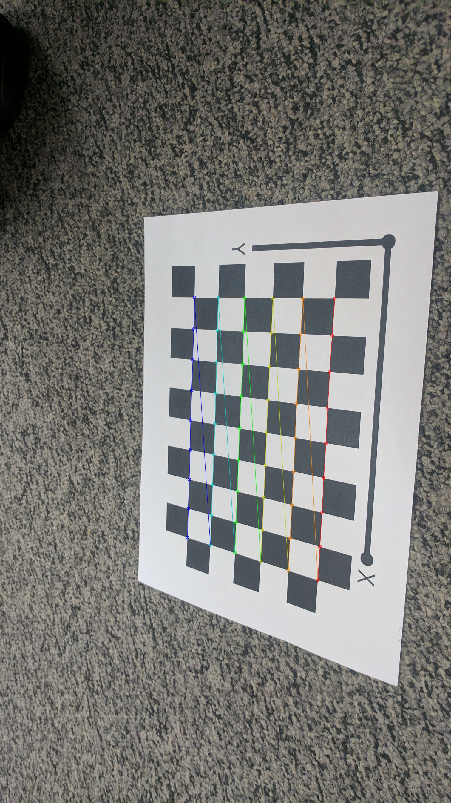
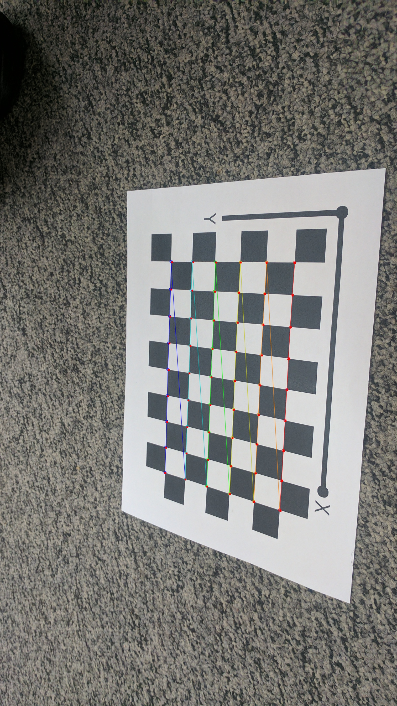

# Zhang's Camera Calibration
This project implements camera calibration method as described by Zhengyou Zhang in his 1998 paper [”A Flexible New Technique for Camera Calibration”](https://www.microsoft.com/en-us/research/wp-content/uploads/2016/02/tr98-71.pdf)

 
## Run instructions

```
python Wrapper.py
```

This was implemented as part of [CMSC733](https://cmsc733.github.io/2022/hw/hw1/) and for detailed report refer [here](https://github.com/naitri/camera-calibration/blob/main/Report.pdf)
